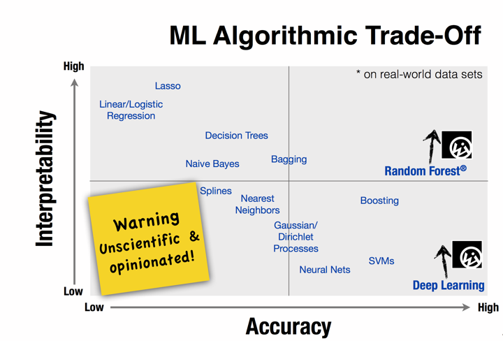

## 機械学習（machine learning）は、何かしらの目的を達成するための知識や行動を、データを読み込ませることで機械に獲得させるための技術です。
機械学習は大きく、教師あり学習（supervised learning）、教師なし学習（unsupervised learning）、強化学習（reinforcement learning）に分けられます（この分け方以外にも、教師あり学習と教師なし学習の2つに分けたり、これらの3つに、さらに半教師あり学習を加えて4つに分けることもあります)。

### ①教師あり学習

説明変数（インプット）から目的変数（アウトプット）を予測するモデルを求める手法です。訓練データには目的変数や説明変数があり、あらかじめ作ったモデルに訓練データの説明変数を入力し、そのモデルからの出力が訓練データの目的変数に近づくようにモデルのパラメータを調整することで学習していきます。この章で詳しく説明します。

たとえば、メールのタイトルや内容（説明変数）からスパムか否か（目的変数）を識別したい、株の売買状況（説明変数）から株価（目的変数）を予測したいときなどに使われます。

### ②教師なし学習

入力データそのものに着目し、データに潜むパターンや示唆を見いだす手法です。訓練データに目的変数や説明変数はありません。多数のデータをいくつかの類似グループに分けるクラスタリングや、データ次元（変数の数）を、元のデータの情報を失わないようにより少数の次元に縮約する主成分分析（PCA:Principle Component Analysis）などの手法があり、データに解釈を与える探索的分析やデータの次元圧縮（dimentional reduction）などに使われます。次の章で詳しく説明します。

以下は、教師あり学習と教師なし学習のイメージです。 左図が教師あり学習です。あらかじめラベル付け（以下は丸とバツ）がされていて、丸とバツに分けたいという目的があります。たとえば、x1とx2の2つの軸を持つデータが新たに与えられ、それが丸なのかバツなのかを予測します。 右図が教師なし学習です。ラベル付けはされておらず、与えられたデータからインサイト（「以下の赤丸に囲まれているグループが2つできそうだ」といった見識）を見つけ出そうとします。

### ③強化学習
強化学習は、プログラム（機械）の一連の行動の結果に対して報酬を与えることで、機械に実現させたい知識や行動ルールを獲得させようとする手法です。教師あり学習では1つ1つの行動に正解データを付与する必要がありますが、特に対戦相手のいるゲームなど相互作用的な環境下で行動ルールを獲得する必要がある場合、すべての局面に対して正解ラベルを付与することは困難です。（※伊佐コメント※やはり、この文章で、「正解データ」と「正解ラベル」の2つの言い方があるのが気になるのですが、あえて別の言葉のままにすべきでしょうか？※）

そのため、一連の行動の結果に基づく報酬によって行動ルールを獲得させようとする強化学習技術という手法は、教師あり学習では表現困難なケースを扱える学習方式として、近年注目を集めています。

## 比較

|| 教師あり | 教師なし | 強化学習 |
||:---:| :---: | :---: | :---: |
||学習データ| 入力とそれにする出力の組 | 入力のみ | 入力と出力に対する評価（報酬） |
||学習結果| 入力と出力の関係 | 類似性、相関性(データのに存在する構造) | ①状況→報酬の関係、②状況→行動の関係 |
||適用シーン| 商品レコメンド、需要予測 | クラスタリング、不正アクセス検知 | 広告・コンテンツ配信の最適化、将棋次の手の最適化 |

## 機械学習モデルの関係について、下図に示す。

by https://hackernoon.com/choosing-the-right-machine-learning-algorithm-68126944ce1f

## 要件を満たすの機械学習モデルについて、下図に示す。（scikit-learn チートシート）

by http://scikit-learn.org/stable/tutorial/machine_learning_map/index.html
